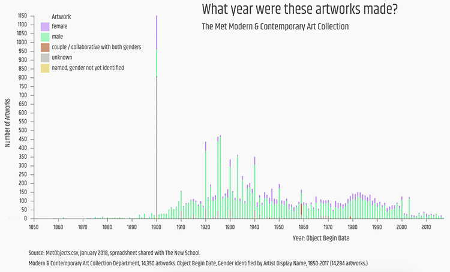

### Major Studio 1, Parsons
Spring 2018

## Quantitative Project

   [Gender at The Met, What % of the Modern & Contemporary Art Collection's 14,350 works are by women?](https://churc.github.io/MajorStudio1/MetProjects/gender) 
   
The Met's Modern and Contemporary Art department collection by gender: visualizing how many male and how many female artworks are represented. 

The displays are by number of artworks, visualizations show total numbers, and a timeline shows number of artworks collected each year by object begin date.
Source: MetObjects.csv, January 2018.

14,350 artworks, ranging from undated, 1437 – 2017, most 'Object Begin Date' entries fall after 1850.
Gender identification using ‘Artist Display Name’ column to identify artists by gender.

Categories:
- female
- male
- couple/collaborative with both genders
- unknown
- artist name but not yet identified

## Qualitative Project

