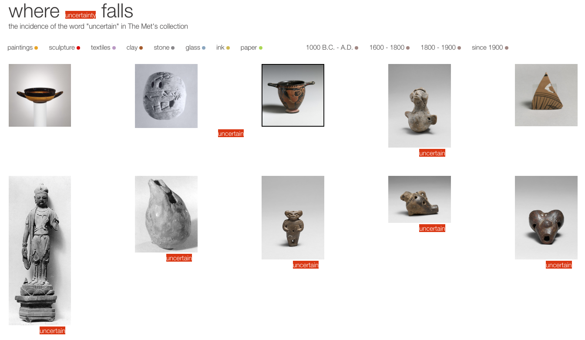

#### Quantitative Project [Gender at The Met, What % of the Modern & Contemporary Art Collection's 14,350 works are by women?](https://churc.github.io/MajorStudio1/MetProjects/gender) 
   
   
### [Source: MetObjects.csv, January 2018](https://github.com/churc/MajorStudio1/tree/master/MetProjects/gender/assets): 14,350 artworks in the Modern and Contemporary Art Collection, range from 1437 – 2017 together with undated, most 'Object Begin Date' entries fall after 1850. ‘Artist Display Name’ column used to identify artists by gender. 
### Gender categories: female; male; couple/collaborative with both genders; unknown; and artist name but not yet identified 

### Using total numbers, wrapped bar visualization, 1 pixel represents 2 artworks: [Gender at The Met](https://churc.github.io/MajorStudio1/MetProjects/gender)
### Using total numbers, vertical bar visualization: [Another View of All Artworks by Gender](https://churc.github.io/MajorStudio1/MetProjects/gender#c2)
### For a timeline, visualization years 1850-2017 (14,284 artworks):  [What Year Were These Artworks Made](https://churc.github.io/MajorStudio1/MetProjects/gender/#c3) 

### Note - spike in the number of artworks in 1900: hundreds of objects have Object Begin Date (and Object End Date) recorded as 1900, most of these are manufactoring companies noted as 'unknown designer.'

### Initial quantitative sketch ideas: [1](https://github.com/churc/MajorStudio1/blob/master/MetProjects/project1_gender.jpg); [2](https://github.com/churc/MajorStudio1/blob/master/MetProjects/project2_uncertainty.jpg); [3](https://github.com/churc/MajorStudio1/blob/master/MetProjects/project3_donations.jpg); [sketches](https://github.com/churc/MajorStudio1/blob/master/MetProjects/MetProjects_churchouse.pdf) for final project; [concept](https://github.com/churc/MajorStudio1/blob/master/MetProjects/MetProject_process_description.pdf)

#### Qualitative Project [Where uncertainty falls: the incidence of the word "uncertain" in The Met's collection](https://churc.github.io/MajorStudio1/MetProjectsQual/uncertainty)

### Display groups of artworks connected by a particular search word, as another way of entering the collection. Are the images related, where do the references appear, what reference similarities or variations are there between different objects?  

### [Json file](https://github.com/churc/MajorStudio1/tree/master/MetProjectsQual/uncertainty/assets) of the artworks returned by two searches on The Met Collection for objects that are in the public domain and that have artwork images. "Uncertain" and "uncertainty" searches returns 426 artworks (March 2018). The visualization focuses on the relation of text and image. 
### Titles and dates hidden, each visible on hover. Click on green button for titles, dates. 204 artworks have uncertain/ty in their web label descriptions. Since these descriptions are not meant to be used elsewhere, each artwork is linked to its website image with web label. 
### The word uncertain/ty is depicted where it occurs within the web label text.
### Material type selections: paintings, sculpture, textiles, clay, stone, glass, ink, paper; and specific time periods link to The Met website searches.
### Uncertainty in the header is linked to the title and date text.
### Click on the green button for random reload.

### [Initial](https://github.com/churc/MajorStudio1/blob/master/MetProjectsQual/MetQual_churchouse.pdf) qualitative sketch ideas; [sketches](https://github.com/churc/MajorStudio1/blob/master/MetProjectsQual/MetQual_uncertainty_churchouse.pdf) for final project; [concepts](https://github.com/churc/MajorStudio1/blob/master/MetProjectsQual/MetQualConcepts2_clarechurchouse.pdf)
