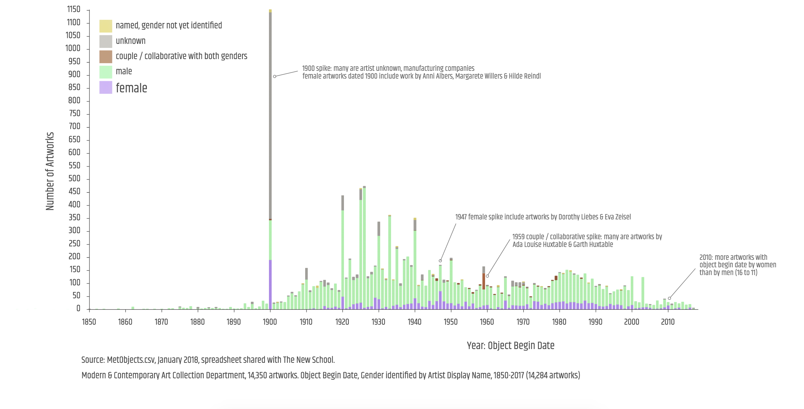
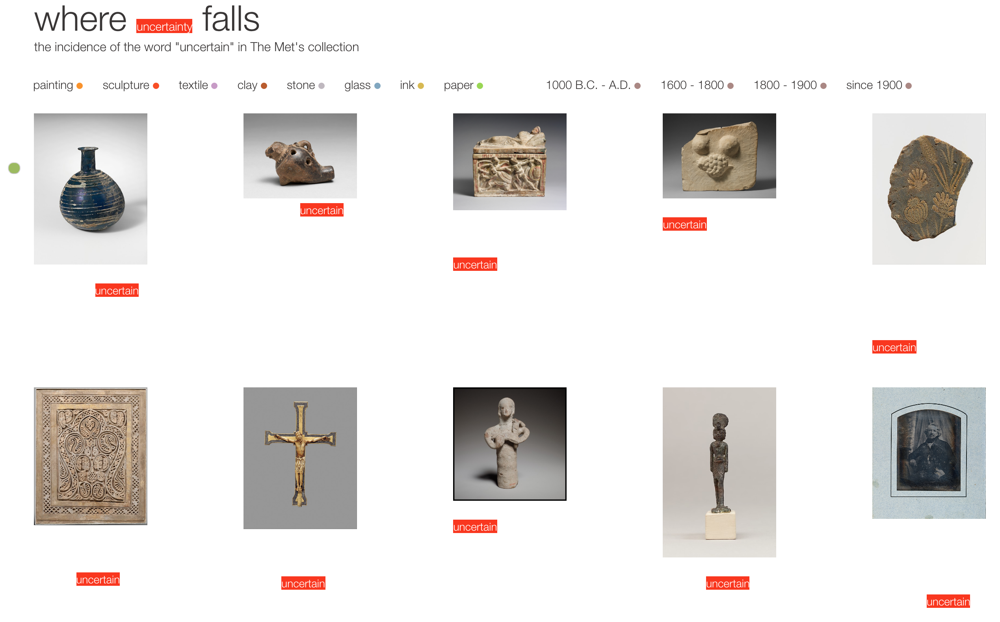
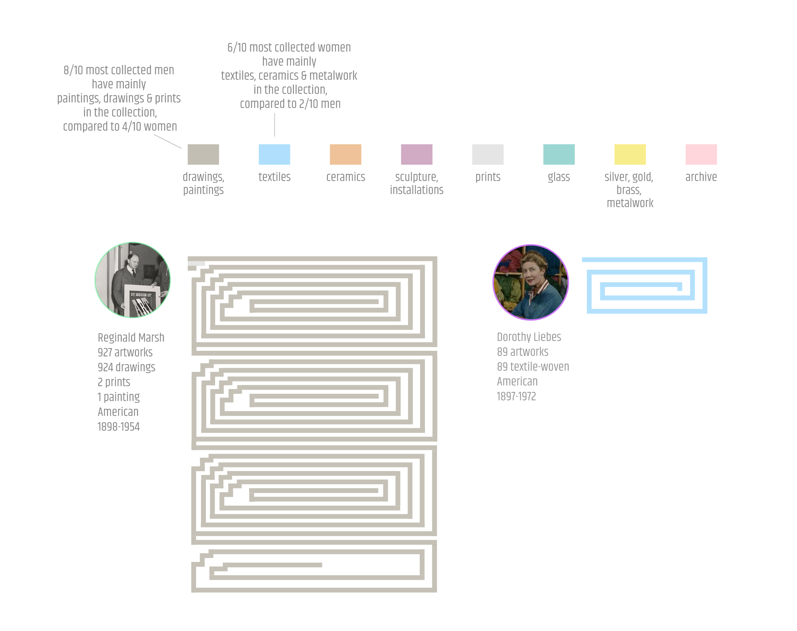
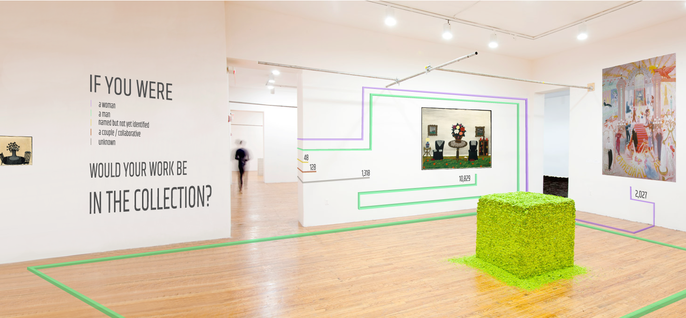

#### **Quantitative Project** [Gender at The Met, What % of the Modern & Contemporary Art Collection's 14,350 works are by women?](https://churc.github.io/MajorStudio1/MetProjects/gender/index.html) 
   

### [Source: MetObjects.csv, January 2018](https://github.com/churc/MajorStudio1/blob/master/MetProjects/gender/assets/ModContGenderfinalazsort.csv): 14,350 artworks in the Modern and Contemporary Art Collection, ranging from 1437 – 2017 together with undated, most 'Object Begin Date' entries fall after 1850. ‘Artist Display Name’ column used to identify artists by gender. 
### Gender categories: female; male; couple/collaborative with both genders; unknown; and artist name but not yet identified 

### Visualizations:
### 1)   Using total numbers, wrapped bar visualization, 1 pixel represents 2 artworks: Gender  
### 2)   Using total numbers, vertical bar visualization: Another view of all artworks by gender
### 3)   For a timeline, visualization years 1850-2017 (14,284 artworks):  What year were these artworks made

### [Initial sketch ideas](https://github.com/churc/MajorStudio1/blob/master/MetProjects/gender/assets/initialsketches.png)
### [Initial concepts](https://github.com/churc/MajorStudio1/blob/master/MetProjects/MetProject_process_description.pdf)
### [Sketches for final project](https://github.com/churc/MajorStudio1/blob/master/MetProjects/MetProjects_churchouse.pdf) 

### Note - spike in the number of artworks in 1900: hundreds of objects have Object Begin Date (and Object End Date) recorded as 1900, most of these are manufacturing companies noted as 'unknown designer.'

#### **Qualitative Project** [Where uncertainty falls: the incidence of the word "uncertain" in The Met's collection](https://churc.github.io/MajorStudio1/MetProjectsQual/uncertainty)

### Display groups of artworks connected by a particular search word, as another way of entering the collection. Are the images related, where do the references appear, what reference similarities or variations are there between different objects? The visualization focuses on the relation of text and image.

### "Uncertain" and "uncertainty" searches returns 426 artworks (March 2018, public domain, with images).
### The word uncertain/ty is depicted where it occurs within the web label text. Titles, dates and descriptions are hidden, visible on hover. 
### Click on red 'uncertainty' text in the header (where uncertainty falls) to view all titles, dates. 204 artworks have uncertain/ty in their web label descriptions. Since the web labels are not in the public domain, each artwork is linked to The Met web label. 
### Material type selections: paintings, sculpture, textiles, clay, stone, glass, ink, paper; and specific time periods link to The Met website searches.
### Click on the green button for random reload.

### [Initial sketch ideas](https://github.com/churc/MajorStudio1/blob/master/MetProjectsQual/MetQual_churchouse.pdf)
### [Initial concepts](https://github.com/churc/MajorStudio1/blob/master/MetProjectsQual/MetQualConcepts2_clarechurchouse.pdf)
### [Sketches for final project](https://github.com/churc/MajorStudio1/blob/master/MetProjectsQual/MetQual_uncertainty_churchouse.pdf) 
### Source: [Json file](https://github.com/churc/MajorStudio1/tree/master/MetProjectsQual/uncertainty/assets/UncertainPub.json)

#### **Interactive Narrative Project** [Gender and Medium](https://churc.github.io/MajorStudio1/Interactive/genderObj/index.html)

### Identify who are the most collected artists in The Met's Modern & Contemporary Art department by gender, and examine what kind of artworks they made. 
### Using the 12,856 artworks made either by women or by men from the total collection of 14,350 artwork; the 'classification' column contains 105 medium types (e.g. drawings, furniture, vases, ceramics, textiles etc.)
### [Source: MetObjects.csv, January 2018](https://github.com/churc/MajorStudio1/blob/master/Interactive/genderObj/assets/ModContGenderfinalazsort.csv)
### Do a series of visualizations that explore connections between gender and medium in the collection.
### [Initial sketch ideas](https://github.com/churc/MajorStudio1/blob/master/Interactive/quant3_churchouse_project1.pdf)
### [Initial concepts](https://github.com/churc/MajorStudio1/blob/master/Interactive/Interactivity_narrative_churchouse.pdf)
### [Sketch ideas](https://github.com/churc/MajorStudio1/blob/master/Interactive/quant2_churchouse_project2.pdf) and [next iteration sketch ideas](https://github.com/churc/MajorStudio1/blob/master/Interactive/quant4_churchouse-16.png)
### [Sketches for final project](https://github.com/churc/MajorStudio1/blob/master/Interactive/finalSketch.png)

### **Spatial Contexts Project** [If you were a woman - a man - would your work be in this collection?](https://churc.github.io/MajorStudio1/SpatialContexts/spatial/index.html)

### Examine ways the gender quantitative project might exist in a spatial context within an art gallery or museum.
### [Initial sketch ideas](https://github.com/churc/MajorStudio1/blob/master/SpatialContexts/spatial_initialSketches.png)
### [Initial concepts](https://github.com/churc/MajorStudio1/blob/master/SpatialContexts/spatial_concept_churchouse.pdf)
### [Sketches 1](https://github.com/churc/MajorStudio1/blob/master/SpatialContexts/ProjectSketches1.png)
### [Sketches 2](https://github.com/churc/MajorStudio1/blob/master/SpatialContexts/ProjectSketches2.png)
### [Spatial context - gallery entrance](https://github.com/churc/MajorStudio1/blob/master/SpatialContexts/museum_extRev2_24.png)
### [Spatial context - gallery space](https://github.com/churc/MajorStudio1/blob/master/SpatialContexts/museum_intRev2_final_24.png)
### [AR](https://github.com/churc/MajorStudio1/blob/master/SpatialContexts/museum_intRev2-mobile-blur-24-final.png)

