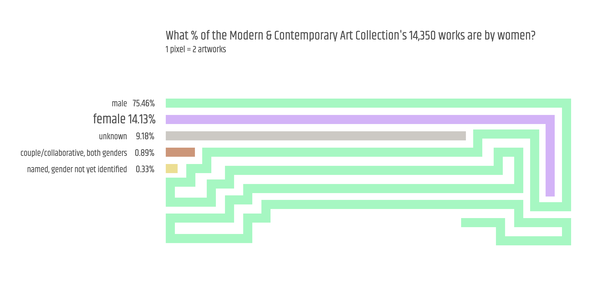

#### **Quantitative Project Part 1:** [Gender at The Met](https://churc.github.io/MajorStudio1/MetProjects/gender)
### What percent of the 14,350 works in The Metropolitan Museum of Art’s Modern & Contemporary Art Collection are by women?

### As part of the [MS Data Visualization’s Major Studio 1](https://parsons.nyc/met-museum/) class at Parsons, we undertook quantitative and qualitative projects using The Metropolitan Museum of Art's Digital Collection [Open Access data](https://github.com/metmuseum/openaccess). The Met's collection spans over 5,000 years and includes roughly one and a half million objects from an array of cultures; over 460,000 of these artworks are in the online database.

### I worked on two closely related quantitative projects: [Gender at The Met](https://churc.github.io/MajorStudio1/MetProjects/gender), and [Gender & medium](https://churc.github.io/MajorStudio1/Interactive/genderObj). Both projects are based on data from The Modern & Contemporary Art Collection, one of The Met's seventeen collection departments. 
### Gender is not formally tracked across The Met's holdings, this project focuses on the one department and aims to: 
###  &nbsp; &nbsp; 1) identify the gender of the artists whose artworks are in The Modern & Contemporary Art Collection; 
###  &nbsp; &nbsp; 2) establish the percentage of artworks made by women; 
###  &nbsp; &nbsp; 3) identify the artworks by medium; 
###  &nbsp; &nbsp; 4) identify who the top collected artists are by gender; and 
###  &nbsp; &nbsp; 5) examine correlations between particular mediums and gender.

### Source: [MetObjects.csv, January 2018](https://github.com/churc/MajorStudio1/blob/master/MetProjects/gender/assets/ModContGenderfinalazsort.csv)

### I focused The Met's Modern & Contemporary Art Collection for a few reasons: most artworks in the department were made since 1850 thus the artworks are easier to track, issues of gender equality were coming to the forefront, and, on a practical note, the department's excel spreadsheet as of January 2018 listed 14,350 artworks – a manageable number of names to identify by gender. 

### I used The Met Open Access spreadsheet's ‘Artist Display Name’ column to identify artists by gender. Many artists have first names that are gender specific, and I used an online genderchecker, The Met website and wiki to identify the remaining names. After reviewing the data, in addition to 'female' and 'male', I added three more categories: 1) "unknown" for artists who are not identified by any name in the spreadsheet (often these are artworks made by manufacturing companies); 2) "named, gender not identified" where I have not yet been able to identify the gender of the artist despite knowing their name; and 3) "couple/collaborative with both genders" where an artwork was made by two or more people of both genders (if the couple or collaborative contained artists of only one gender, the artwork was noted as such - either 'female' or 'male'.)
### Gender categories: female; male; couple/collaborative with both genders; unknown; and artist name known but gender not yet identified. 

### I used the spreadsheet’s ‘Object Begin Date’ column for the date of the artwork. Of the 14,350 artworks in the department, most 'Object Begin Date' entries fall after 1850, however 66 are either undated or range from 1437 – 1850. The timeline chart uses the 14,284 artworks dated 1850-2017.
 
 

### [Gender at The Met visualizations](https://churc.github.io/MajorStudio1/MetProjects/gender):

 <ul><h3>
  <li>-  Gender: using total numbers, wrapped bar visualization, 1 pixel represents 2 artworks</li>
  <li>-  Another view of all artworks by gender: using total numbers, vertical bar visualization</li>
  <li>-  What year were these artworks made?: timeline visualization, years 1850-2017 (14,284 artworks)</li>
  </h3>
 </ul>

 

### Note: there is a spike in the number of artworks in 1900. Hundreds of objects have 'Object Begin Date' (and 'Object End Date') recorded as 1900 - most of these are manufacturing companies noted as 'unknown designer.'

 &nbsp; &nbsp; &nbsp; &nbsp;
 

#### **Quantitative Project Part 2:** [Gender & medium](https://churc.github.io/MajorStudio1/Interactive/genderObj)
### Who are the most collected women and men in The Met’s Modern & Contemporary Art Collection and what did they make? 

### Source: [MetObjects.csv, January 2018](https://github.com/churc/MajorStudio1/blob/master/Interactive/genderObj/assets/ModContGenderfinalazsort.csv)

 

### Using the 12,856 artworks made either by women or by men from the total 14,350 artworks in the department, and the ‘Classification’ column containing 105 medium types (e.g. drawings, furniture, vases, ceramics, textiles etc), I investigated correspondences between artwork medium and gender.

### Gender & medium focuses on who (female/male) made the artworks in the collection, who the top collected artists are by gender, what medium their artworks are, and the relation between medium and gender.

 

### [Gender & medium visualizations](https://churc.github.io/MajorStudio1/Interactive/genderObj/index.html): 
### Two visualizations from the Gender at The Met project are included here and connections between medium and gender in the collection are explored.

 <ul><h3>
  <li>-  Gender: using total numbers, wrapped bar visualization, 1 pixel represents 2 artworks</li>
  <li>-  What year were these artworks made?: timeline visualization, years 1850-2017 (14,284 artworks)</li>
  <li>-  What medium are being collected by gender?: vertical bar visualization of medium by gender using the 'Classification' column identifying 105 mediums</li>
  <li>-  Who are the most collected women and men in the Modern & Contemporary Art Collection and what did they make?: showing the top ten collected women and the top ten collected men in the Collection, and drawing connections between the artwork medium collected in the case of the top female artists and the top male artists</li>
  </h3>
 </ul>

### Findings include:
### Selecting the 12,856 artworks either by women or by men in the Modern & Contemporary Art Collection, 15.77% artworks are made by women, and 84.23% are by men.
### Dorothy Liebes has the most number of artworks in the Modern & Contemporary Art Collection with 89 artworks. This compares to the most collected man, Raymond Marsh, who is represented by 927 artworks. 
### Notably, of the top ten women collected, only 4 out of 10: Margarete Willers, Lygia Pape, Georgia O’Keeffe and Hilde Reindl, are predominantly represented in the Collection with drawings and paintings. The opposite holds true for men, with 8 out of 10 men principally represented in the Collection with paintings, drawings and prints.
### And 6 out of the top ten women collected are mainly represented by textiles, ceramics, and metalwork, compared to only 2 out of the top ten collected men. 
### It is striking to note that of the mediums that contain more than 10 artworks, men outnumber women in each of the mediums collected by the department with the exception of textile-related mediums. Here, women outnumber men in the following classifications: ‘Textiles-miscellaneous’: 12 by women, 0 by men; ‘Textiles-samples books’: 13 women, 1 man; ‘Textiles-tapestries’: 21 women, 9 men; ‘Textiles’: 59 women, 7 men; ‘Textiles-woven’ 251 women, 36 men.
### There are 2,137 paintings in the Collection, 280 paintings are by female artists and 1,857 are by male artists; similarly with drawings, 523 are by women and 4,553 are by men.

### The ten women with the highest number of artworks in the Modern & Contemporary Art Collection:
###  &nbsp; &nbsp; 1) Dorothy Liebes: 89 artworks
###  &nbsp; &nbsp; 2) Anni Albers: 80
###  &nbsp; &nbsp; 3) Margarete Willers: 65
###  &nbsp; &nbsp; 4) Vuokko Eskolin-Nurmesniemi: 52
###  &nbsp; &nbsp; 5) Eva Zeisel: 51
###  &nbsp; &nbsp; 6) Hilde Reindl: 48
###  &nbsp; &nbsp; 7) Gunta Stolzl: 39
###  &nbsp; &nbsp; 8) Marion Weeber: 35
###  &nbsp; &nbsp; 9) Lygia Pape: 32
###  &nbsp; &nbsp; 10) Georgia O'Keeffe: 22

### The ten men with the highest number of artworks in the Modern & Contemporary Art Collection:
###  &nbsp; &nbsp; 1) Raymond Marsh: 927 artworks
###  &nbsp; &nbsp; 2) Carlo Scarpa: 244
###  &nbsp; &nbsp; 3) Louis A. Stirn: 172
###  &nbsp; &nbsp; 4) Abraham Walkowitz: 167
###  &nbsp; &nbsp; 5) Pablo Picasso: 149
###  &nbsp; &nbsp; 6) Jackson Pollock: 117
###  &nbsp; &nbsp; 7) Henri Matisse: 105
###  &nbsp; &nbsp; 8) Marsden Hartley: 104
###  &nbsp; &nbsp; 9) Paul Klee: 98
###  &nbsp; &nbsp; 10) Arthur Dove: 81

 

 &nbsp; &nbsp; &nbsp; &nbsp; &nbsp;

#### **Qualitative Project:** [Where uncertainty falls](https://churc.github.io/MajorStudio1/MetProjectsQual/uncertainty)
### The incidence of the word "uncertain" in The Met's collection

### Source: [Json file](https://github.com/churc/MajorStudio1/tree/master/MetProjectsQual/uncertainty/assets/UncertainPub.json)

### This qualitative project uses public domain images from the whole of The Met database using ‘uncertain’ and ‘uncertainty’ as a search term and organizing principle to view what is assessed in the text as ‘uncertain.’ The visualization focuses on the relation of text and image.
### The word uncertain/ty is depicted where it occurs within the web label text, on titles or on dates. Titles, dates and descriptions are hidden, visible on hover. 
### Click on red 'uncertainty' text in the header (where uncertainty falls) to view the text. 204 artworks have uncertain/ty in their web label descriptions. Click on the green button for random reload.

### [Where uncertainty falls visualization](https://churc.github.io/MajorStudio1/MetProjectsQual/uncertainty/)

 &nbsp; &nbsp; &nbsp; &nbsp;
 
 

#### **Spatial Contexts Project:** [Who's in this room by gender?](https://churc.github.io/MajorStudio1/SpatialContexts/spatial) 
### If you were a woman - a man - would your work be in this collection?

 &nbsp; &nbsp;

  

### The project depicts a spatial line installation in an art gallery space - the line lengths represent the percent of female / male artists by gender within each room; lines of color run across the floor – making the viewer step over them – and wrap up the walls to end at specific artworks; the percent number at the end of each line specifies the % gender representation within each room. The idea was to explore ways the gender quantitative project might exist within a museum situation and engage the viewer.

### [Spatial context - gallery entrance](https://github.com/churc/MajorStudio1/blob/master/SpatialContexts/museum_extRev2_24.png)

### Looking through your phone as you enter a gallery, you can ‘see’ the lines as if they are in the physical space, depicting the gender of the artists with work in that room.

### [Who's in this room by gender visualization](https://churc.github.io/MajorStudio1/SpatialContexts/spatial)

&nbsp;

### [Projects process webpage](https://churc.github.io/MajorStudio1/process/)

&nbsp;

### Huge thanks to Professor Richard The, Assistant Professor of Interaction Design, Parsons The New School, for help realizing these projects from data analysis to design, and to The Met's Digital Collection experts who generously shared their time and their incredible knowledge of the collection with us. In particular, Jennie Choi, General Manager of Collection Information, who along with Spencer Kiser, Lead Developer, introduced the Museum’s digital work to us, and to Jennie and to Loic Tallon, Chief Digital Officer, who we presented our projects to, for their invaluable feedback.  

