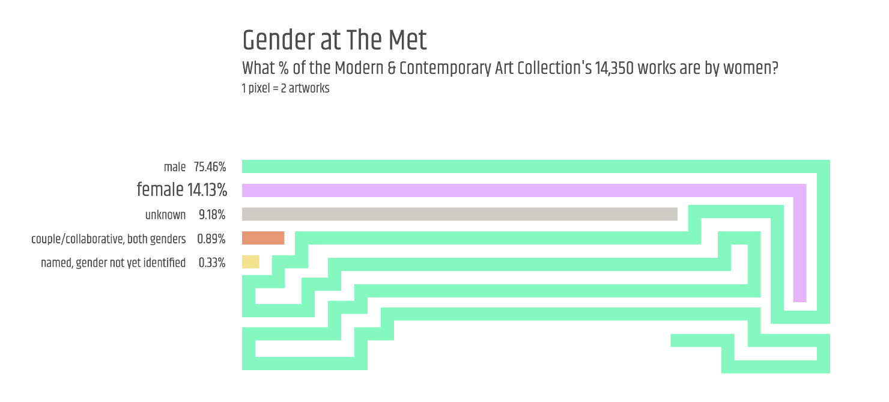

#### **Quantitative Project Part 1:** [Gender at The Met](https://churc.github.io/MajorStudio1/MetProjects/gender)
### What percent of the 14,350 works in The Metropolitan Museum of Art’s Modern & Contemporary Art Collection are by women?

### As part of the MS Data Visualization’s Major Studio 1 class at Parsons, we undertook quantitative and qualitative projects using The Metropolitan Museum of Art's Digital Collection's [open access data](https://github.com/metmuseum/openaccess). The collection spans over 5,000 years and includes roughly one and a half million objects from an array of cultures; over 460,000 of these artworks are in the online database.

### I did two - related - quantitative projects: Gender at The Met, and Gender & medium. They both focus on The Modern & Contemporary Art Collection, one of The Met's seventeen collection departments. Gender is not formally tracked across The Met's holdings, and this project aims to: 1) identify the artworks by gender; 2) establish the percentage of artworks made by women; 3) identify the artworks by medium; 4) identify who the top collected artists are by gender in the Collection; and 5) examine correlations between particular mediums and gender.

### Source: [MetObjects.csv, January 2018](https://github.com/churc/MajorStudio1/blob/master/MetProjects/gender/assets/ModContGenderfinalazsort.csv)
### I used The Met's Modern & Contemporary Art Collection department for a few reasons: most artworks in the department were made since 1850 thus the artworks are easier to track, issues of gender equality were coming to the forefront, and, on a practical note, the department's excel spreadsheet as of January 2018 listed 14,350 artworks – a manageable number to identify by gender. 
### I used the spreadsheet's ‘Artist Display Name’ column to identify artists by gender. Many artists have first names that are gender specific, and I used an online genderchecker, The Met website and wiki to identify the remaining names. After reviewing the data, in addition to 'female' and 'male', I added three more 'gender' categories: 1) "unknown" for artists who are not identified by any name in the spreadsheet (often these are artworks made by manufacturing companies); 2) "named, gender not identified" where I have not yet been able to identify the gender of the artist despite knowing their name; and 3) "couple/collaborative with both genders" where an artwork was made by two or more people of both genders (if the couple or collaborative contained artists of only one gender, the artwork was given the gender category,'female' or 'male'.)
### Gender categories: female; male; couple/collaborative with both genders; unknown; and artist name but not yet identified. 
### Of the 14,350 artworks in the department, most 'Object Begin Date' entries fall after 1850, however 66 are either undated or range from 1437 – 1850. I used the ‘Object Begin Date’ column for the date of the artwork. The timeline chart uses the 14,284 artworks dated 1850-2017.
 

### [Visualizations](https://churc.github.io/MajorStudio1/MetProjects/gender):
### 1)   Using total numbers, wrapped bar visualization, 1 pixel represents 2 artworks: Gender  
### 2)   Using total numbers, vertical bar visualization: Another view of all artworks by gender
### 3)   For a timeline, visualization years 1850-2017 (14,284 artworks):  What year were these artworks made?

&nbsp; &nbsp;

### Note - spike in the number of artworks in 1900: hundreds of objects have Object Begin Date (and Object End Date) recorded as 1900, most of these are manufacturing companies noted as 'unknown designer.'

 &nbsp; &nbsp; &nbsp; &nbsp;

#### **Quantitative Project Part 2:** [Gender & medium](https://churc.github.io/MajorStudio1/Interactive/genderObj/index.html)
### Who are the most collected women and men in The Met’s Modern & Contemporary Art Collection and what did they make? 

 
### Using the 12,856 artworks made either by women or by men from the total collection of 14,350 artwork, and the 'classification' column contains 105 medium types (e.g. drawings, furniture, vases, ceramics, textiles etc.)
### Quantitative part 2 looked at the artworks by medium, identified who the top collected artists are by gender in the Collection, and looked at the relation between particular mediums and gender.

### [Visualizations](https://churc.github.io/MajorStudio1/Interactive/genderObj/) 
### Two visualizations from the Gender at The Met project are included here and then connections between medium and gender in the collection are explored:
### 1)   Using total numbers, wrapped bar visualization, 1 pixel represents 2 artworks: Gender  
### 2)   For a timeline, visualization years 1850-2017 (14,284 artworks):  What year were these artworks made?
### 3)   Using the classification column identifying 105 mediums, vertical bar visualization of medium by gender: What medium are being collected by gender?
### 4)   Identifying the top ten collected women and the top ten collected men and their artworks by medium: Who are the most collected women and men in this collection and what did they make?

### Findings include:
### Selecting the 12,856 artworks either by women or by men in the Modern & Contemporary Art Collection, 15.77% artworks are made by women, and 84.23% are by men.
### Dorothy Liebes has the most number of artworks in the Modern & Contemporary Art Collection with 89 artworks. This compares to the most collected man, Raymond Marsh, who is represented by 927 artworks. 
### Notably, of the top ten women collected, only 4 out of 10: Margarete Willers, Lygia Pape, Georgia O’Keeffe and Hilde Reindl, are predominantly represented in the Collection with drawings and paintings. The opposite holds true for men, with 8 out of 10 men principally represented in the Collection with paintings, drawings and prints.
### And 6 out of the top ten women collected are mainly represented by textiles, ceramics, and metalwork, compared to only 2 out of the top ten collected men. 
### Looking at mediums that contain more than 10 artworks, men outnumber women in each of the mediums collected by the department with the exception of textile-related mediums. Here, women outnumber men in the following classifications: ‘textiles-miscellaneous’: 12 by women, 0 by men; ‘textiles-samples books’: 13 women, 1 man; ‘textiles-tapestries’: 21 women, 9 men; ‘textiles’: 59 women, 7 men; ‘textiles-woven’ 251 women, 36 men.
### There are 2,137 paintings in the Collection, 280 paintings are by female artists and 1,857 are by male artists; similarly with drawings, 523 are by women and 4,553 are by men.

### Source: [MetObjects.csv, January 2018](https://github.com/churc/MajorStudio1/blob/master/Interactive/genderObj/assets/ModContGenderfinalazsort.csv)

 &nbsp; &nbsp; &nbsp; &nbsp;

#### **Qualitative Project:** [Where uncertainty falls](https://churc.github.io/MajorStudio1/MetProjectsQual/uncertainty)
### The incidence of the word "uncertain" in The Met's collection

### This qualitative project uses public domain images from the whole of The Met database using ‘uncertain’ and ‘uncertainty’ as a search term and organizing principle to view what is assessed in the text as ‘uncertain.’ The visualization focuses on the relation of text and image.
### The word uncertain/ty is depicted where it occurs within the web label text, on titles or on dates. Titles, dates and descriptions are hidden, visible on hover. 
### Click on red 'uncertainty' text in the header (where uncertainty falls) to view all titles, dates. 204 artworks have uncertain/ty in their web label descriptions. Since the web labels are not in the public domain, each artwork is linked to The Met web label. Click on the green button for random reload.

### [Visualization](https://churc.github.io/MajorStudio1/MetProjectsQual/uncertainty/)

### Source: [Json file](https://github.com/churc/MajorStudio1/tree/master/MetProjectsQual/uncertainty/assets/UncertainPub.json)

 &nbsp; &nbsp; &nbsp; &nbsp;
 

#### **Spatial Contexts Project:** [Who's in this room by gender?](https://churc.github.io/MajorStudio1/SpatialContexts/spatial/index.html) 
### If you were a woman - a man - would your work be in this collection?

 &nbsp; &nbsp;

 &nbsp; 

### The project depicts a spatial line installation an art gallery space that represents the percent of female / male artists by gender within each room; lines of color that run across the floor – making the viewer step over them – and wrap up the walls to end at specific artworks; % at the end of each line specify the % gender representation within each room. The idea was to examine ways the gender quantitative project might exist within a museum situation and engage the viewer.

### [Spatial context - gallery entrance](https://github.com/churc/MajorStudio1/blob/master/SpatialContexts/museum_extRev2_24.png)

### [AR](https://github.com/churc/MajorStudio1/blob/master/SpatialContexts/museum_intRev2-mobile-blur-24-final.png) - looking through your phone as you enter a gallery, you can ‘see’ the lines as if they are in the physical space, depicting the gender of the artists with work in that room.

&nbsp; 
### [Projects process webpage](https://churc.github.io/MajorStudio1/process/)
&nbsp;
### Huge thanks to Professor Richard The, Data Visualization, The New School, for help realizing these projects from data analysis to design, and to The Met's Digital Collection experts who generously shared their time and their incredible knowledge of the collection with us. In particular, Jennie Choi, General Manager of Collection Information, who along with Spencer Kiser, Media Technology Manager, introduced the Museum’s digital work to us, and to Jennie and to Loic Tallon, Chief Digital Officer, who we presented our projects to, for their invaluable feedback.  

